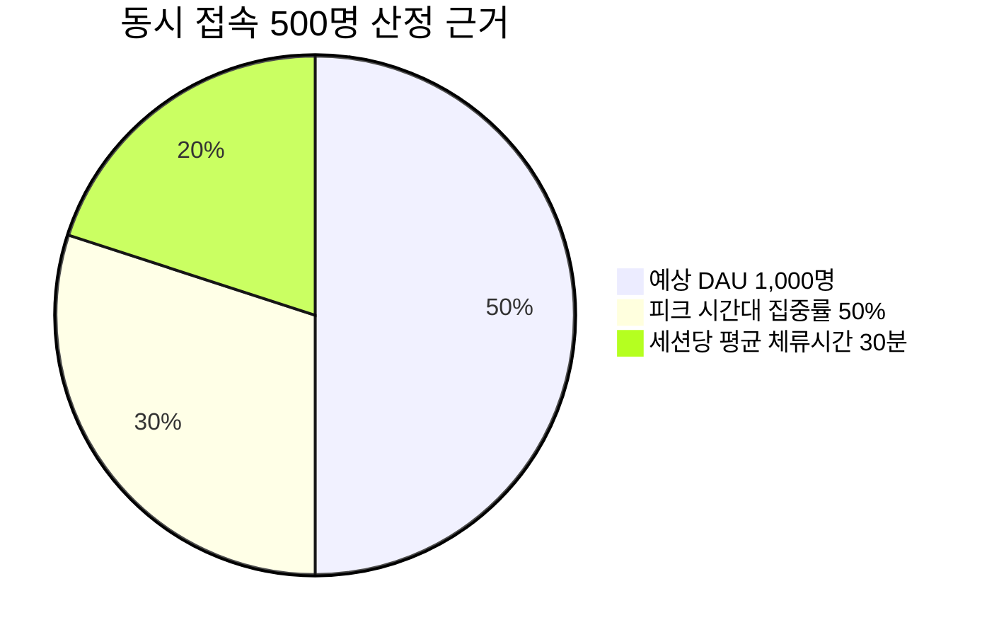
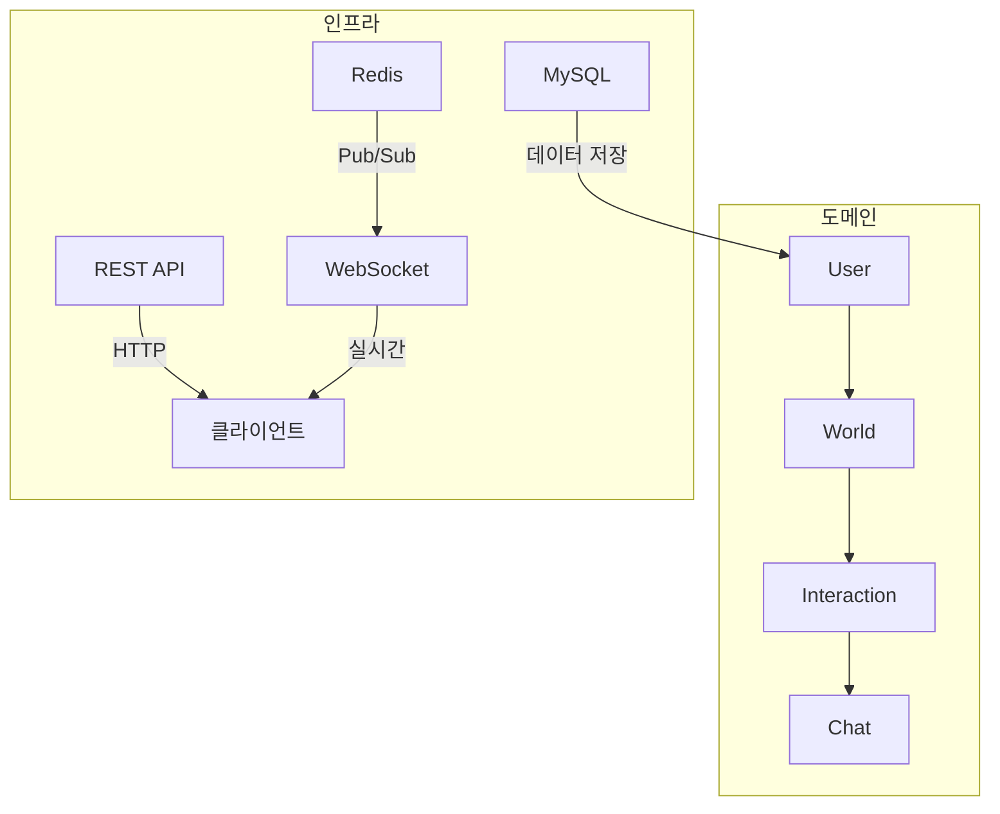
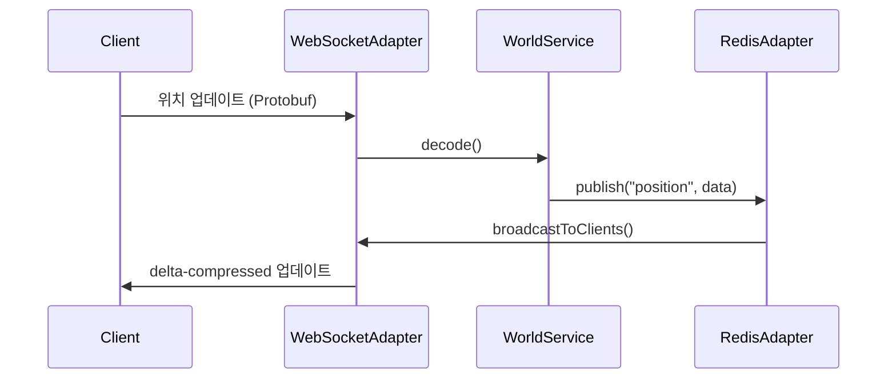
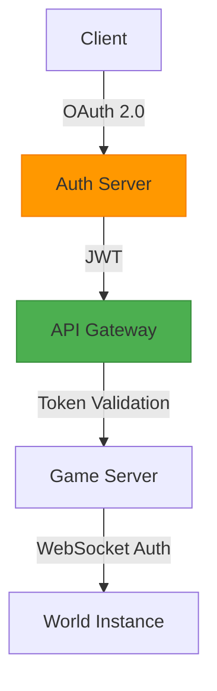
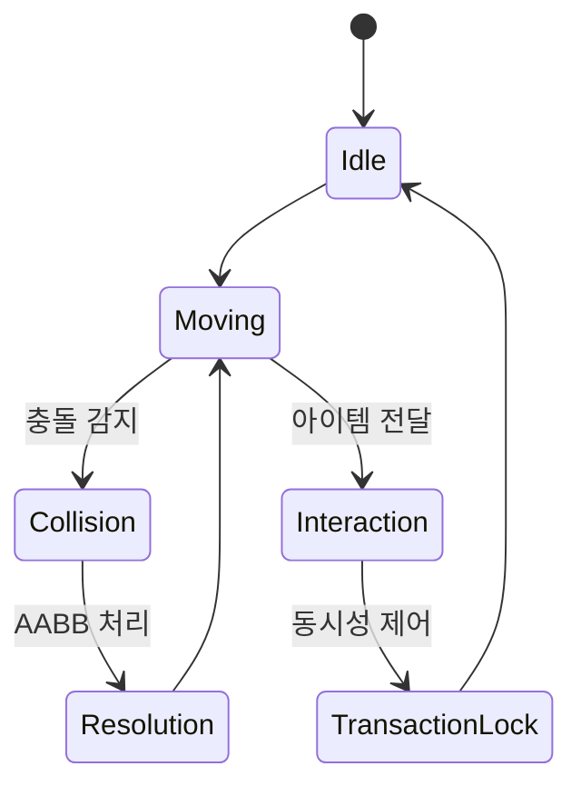
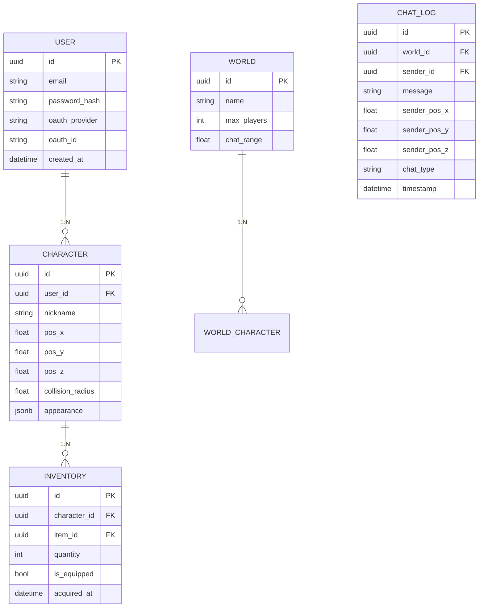
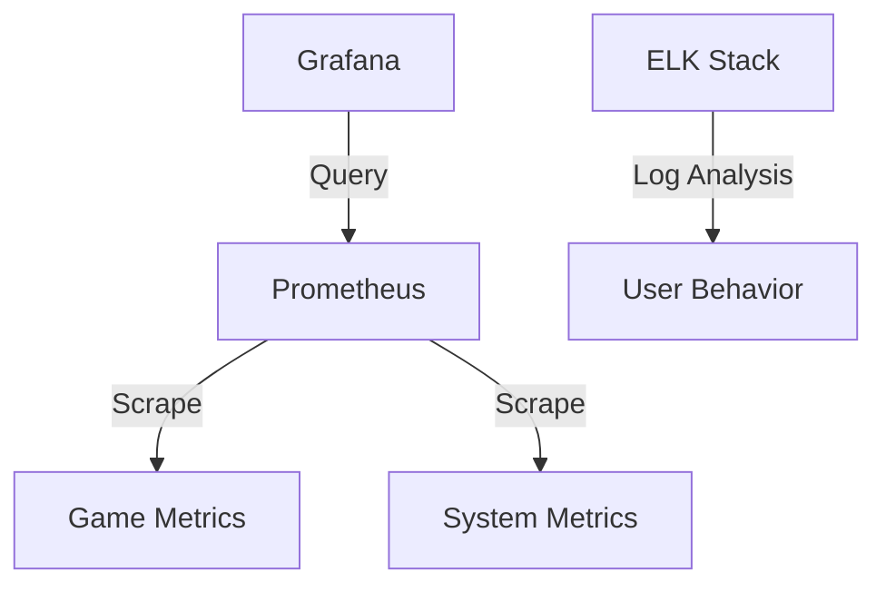
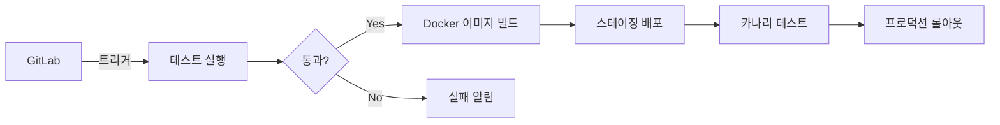

# **CopZone MVP 개발 문서**

**버전**: 1.0

**최종 업데이트**: 2025.02.04

**목표**: 8주 내 1,000 DAU 지원 가능한 안정적 MVP

-----
## **1. MVP 개요**

### 핵심 목표
- **필수 기능**: 회원가입/로그인, 캐릭터 생성, 월드 입장, 실시간 채팅 및 상호작용
- **성능 목표**: 동시 접속 500명, 평균 응답 시간 < 300ms
- **보안 요구사항**: JWT 인증, WebSocket 암호화, 비속어 필터링

### 핵심 사용자 시나리오
```plaintext
1. 사용자 회원가입 → 캐릭터 생성 → 월드 입장  
2. 월드 내 자유 이동 → 다른 캐릭터와 실시간 채팅  
3. 아이템 줍기/버리기 → 간단한 거래(Alpha 버전)  
```

### 성능 목표 근거


* **계산식**: `(1,000 DAU × 50% 동시 접속률) × 2시간 피크 지속 = 500명`
* **검증 계획**: Locust로 1,000 RPS 부하 테스트 수행 (Phase 3에 포함)

-----

## **2. 아키텍처 설계**

### Hexagonal Architecture 구성


### 포트-어댑터 상호작용 흐름1


### 보안 아키텍처


### 캐릭터 상호작용 시스템


-----

## **3. 기술스택**

### **백엔드 기술 스택**
1. **프레임워크**: **Spring Boot**
   - **Spring WebFlux**: 리액티브 프로그래밍을 통한 비동기 처리 및 고성능 지원.
   - **Spring Security**: JWT 기반 인증 및 권한 관리.
   - **Spring Data JPA**: MySQL 기반 데이터베이스 연동.
2. **웹소켓 기술**: **Socket.IO** + **Redis Adapter**
   - **Socket.IO**: 실시간 양방향 통신을 위한 라이브러리. 빠른 개발과 방 개념 지원.
   - **Redis**: 메시지 큐 및 Pub/Sub 기능을 이용해 메시지 브로드캐스트.
3. **데이터베이스**: **MySQL** / **RDS**
   - **MySQL**: 관계형 데이터 저장. `CHARACTER`, `WORLD`, `USER`, `CHAT_LOG` 테이블 관리.
   - **RDS (AWS)**: 관리형 데이터베이스 서비스를 통한 안정성 및 확장성 보장.
4. **캐시**: **Redis**
   - 실시간 게임 상태, 월드 상태 등을 캐시하여 빠른 데이터 접근.
   - **Redis Pub/Sub**: 동시 접속자 관리 및 실시간 이벤트 전파.
5. **메시징 시스템**: **Kafka** (추후 확장)
   - **Kafka**: 대규모 메시징 및 이벤트 기반 아키텍처를 위해 추후 도입 고려.
   - 초기에는 Redis로 처리하고, 필요 시 Kafka로 확장.
6. **배포 및 CI/CD**: **Docker**, **AWS ECS**
   - **Docker**: 애플리케이션 컨테이너화, 이식성 및 확장성 강화.
   - **AWS ECS**: AWS에서의 컨테이너 관리 및 배포.
7. **에러 및 성능 모니터링**: **Prometheus**, **Grafana**, **CloudWatch**
   - **Prometheus**: 시스템 모니터링 및 알람을 위한 데이터 수집.
   - **Grafana**: 성능 대시보드 및 지표 시각화.
   - **CloudWatch**: AWS 리소스의 로그 및 메트릭 모니터링.

### **프론트엔드 기술 스택**
1. **프레임워크**: **React.js** / **Redux**
   - **React.js**: UI 컴포넌트 기반의 동적인 웹 애플리케이션 개발.
   - **Redux**: 애플리케이션 상태 관리를 위한 라이브러리.
2. **실시간 통신**: **Socket.IO 클라이언트**
   - **Socket.IO**: 서버와의 실시간 양방향 통신을 위한 클라이언트 라이브러리.
   - **WebRTC** (향후 확장): 음성 및 영상 채팅을 위한 P2P 통신 지원.
3. **스타일링**: **CSS-in-JS** (예: Styled Components)
   - **Styled Components**: JS 코드 내에서 스타일링을 정의하여 컴포넌트 기반 UI 구축.
4. **상태 관리 및 API 호출**: **Redux**, **Axios**
   - **Redux**: 애플리케이션의 전역 상태 관리.
   - **Axios**: 서버와의 비동기 HTTP 요청을 위한 라이브러리.
5. **디자인 시스템**: **Material UI**
   - **Material UI**: Google의 Material Design 시스템을 기반으로 한 UI 컴포넌트 라이브러리.
6. **실시간 위치 업데이트**: **WebSocket** 연결
   - **WebSocket**을 사용하여 서버로부터 실시간 위치 업데이트를 수신하고 UI에 반영.
7. **성능 최적화**: **React Lazy Loading**
   - **React.lazy**와 **Suspense**: 화면 로딩 성능 최적화를 위한 코드 분할.
8. **빌드 및 배포**: **Webpack**, **Babel**, **Netlify** / **AWS Amplify**
   - **Webpack**: 모듈 번들러로 프론트엔드 리소스 최적화.
   - **Babel**: 최신 JavaScript 기능을 구형 브라우저에서도 동작하도록 변환.
   - **Netlify** / **AWS Amplify**: 프론트엔드 배포를 위한 플랫폼.

### **보안 관련 기술**
1. **WebSocket 인증 및 인가**: **JWT (JSON Web Token)**
   - 클라이언트와 서버 간 WebSocket 연결 시 인증 및 권한 부여를 위한 **JWT** 사용.
   - WebSocket 연결 초기 시 토큰을 헤더에 포함시켜 인증.
2. **Rate Limiting**: **Redis 기반**
   - **Redis**를 활용한 실시간 Rate Limiting을 구현하여 악의적인 요청을 방지.
   - 예: 초당 50개 메시지 제한.
3. **CORS 및 CSRF 보호**
   - **CORS**: 서버와 클라이언트 간의 도메인 차이를 고려한 안전한 통신.
   - **CSRF 보호**: 클라이언트-서버 간 상호작용에서의 보안 강화.

------

### **향후 확장성 기술**
1. **WebRTC 음성/영상 채팅**:
   - **SFU(Server-side Selective Forwarding Unit)** 구조를 사용하여 여러 사용자가 동시에 음성/영상 채팅을 할 수 있도록 확장 예정.
   - **Janus Gateway** 활용: 멀티 유저 환경을 지원하는 SFU 서버 구성.
2. **멀티 채널/채팅방**:
   - 채팅방 시스템에서 **공용** 및 **비공용** 채팅방을 지원하고, **프라이빗 메시지** 및 **그룹 메시지** 기능 추가.
   - **채팅방별 사용자 관리**: WebSocket을 통해 각 채팅방에 접속한 사용자 리스트 관리.

-----

## **4. 데이터 모델 (ERD)**



## **5. API 명세**
 
상세 내용은 [CopZone API 명세서](2025_2_4_2.CopZone-API-Specification.md) 문서 참고

### REST API
| **엔드포인트**           | **메서드** | **설명**                    | **보안**     |
| :----------------------- | :--------- | :-------------------------- | :----------- |
| `/api/users/register`    | POST       | 회원가입 (이메일 검증 포함) | Rate-limited |
| `/api/worlds/{id}/enter` | POST       | 월드 입장 (JWT 필수)        | JWT Required |
| `/api/items`             | GET        | 기본 아이템 목록 조회       | Public       |

### WebSocket
| **경로**    | **프로토콜** | **이벤트 타입**   | **페이로드 예시**                     |
| :---------- | :----------- | :---------------- | :------------------------------------ |
| `/ws/world` | Socket.IO    | `position_update` | `{x: 12.3, y: 5.7, timestamp: 1234}`  |
| `/ws/chat`  | Socket.IO    | `message`         | `{content: "안녕!", sender: "user1"}` |

-----

## **6. 보안 설계**

### 인증 시스템
1. **OAuth 2.0 제공자**
   - Google
   - Discord
   - Apple (모바일용)

2. **WebSocket 보안**
   - 연결 시 JWT 검증
   - 60분마다 토큰 재발급
   - 비정상 패킷 필터링
     ```javascript
     // Rate limiting 설정
     const rateLimiter = {
       chat: { count: 5, period: "10s" },
       movement: { count: 20, period: "1s" },
       interaction: { count: 3, period: "1s" }
     };
     ```

### 비정상 행위 탐지
1. **패킷 검증**
   ```java
   @Aspect
   @Component
   public class PacketValidator {
       @Before("execution(* com.copzone.ws.handler.*.*(..))")
       public void validatePacket(JoinPoint jp) {
           Packet packet = (Packet) jp.getArgs()[0];
           validateSequence(packet);
           validateRate(packet);
           validatePosition(packet);
       }
   }
   ```

-----

## **7. 상호작용 시스템**

### 충돌 처리
1. **Spatial Hashing**
   ```javascript
   class SpatialHash {
     constructor(cellSize = 10) {
       this.cellSize = cellSize;
       this.grid = new Map();
     }
     
     getHash(x, y) {
       return `${Math.floor(x/this.cellSize)},${Math.floor(y/this.cellSize)}`;
     }
     
     insert(entity) {
       const hash = this.getHash(entity.x, entity.y);
       if (!this.grid.has(hash)) {
         this.grid.set(hash, new Set());
       }
       this.grid.get(hash).add(entity);
     }
   }
   ```

2. **아이템 전달 동시성 제어**
   ```java
   @Transactional(isolation = SERIALIZABLE)
   public void transferItem(UUID fromId, UUID toId, UUID itemId) {
     try {
       lockingService.acquireLock(fromId, toId);
       // 아이템 전달 로직
     } finally {
       lockingService.releaseLock(fromId, toId);
     }
   }
   ```

### 채팅 시스템
1. **범위 기반 채팅**
   ```java
   public class ChatService {
     private static final float GLOBAL_CHAT_RANGE = Float.MAX_VALUE;
     private static final float LOCAL_CHAT_RANGE = 50.0f;
     
     public void broadcastMessage(ChatMessage msg) {
       float range = msg.getType() == ChatType.GLOBAL 
         ? GLOBAL_CHAT_RANGE 
         : LOCAL_CHAT_RANGE;
         
       worldService.getPlayersInRange(
         msg.getSenderPosition(), 
         range
       ).forEach(player -> 
         webSocket.send(player.getId(), msg)
       );
     }
   }
   ```

-----

## **8. 모니터링 시스템**

### 대시보드 구성


### 핵심 메트릭
1. **월드 부하 모니터링**
   - 월드별 동시접속자 수
   - 초당 상호작용 수
   - 메모리 사용량

2. **사용자 행동 분석**
   ```sql
   SELECT 
     DATE_TRUNC('hour', timestamp) as time_bucket,
     COUNT(*) as interaction_count,
     AVG(distance) as avg_movement
   FROM user_actions
   GROUP BY time_bucket
   ORDER BY time_bucket DESC;
   ```

3. **알림 설정**
   ```yaml
   alerts:
     high_load:
       condition: "cpu_usage > 80% for 5m"
       channels: ["slack", "email"]
     error_spike:
       condition: "error_rate > 5% for 1m"
       channels: ["pagerduty"]
   ```

-----

## **9. 캐릭터 상호작용 시스템**

### 충돌 처리 최적화
- Quadtree 기반 공간 분할
- AABB 충돌 박스 + 구체 충돌 하이브리드
- 비동기 충돌 계산 (Web Worker 활용)

### 동시성 제어
- 낙관적 락킹 (물리 시뮬레이션)
- 비관적 락킹 (거래 시스템)
- 버전 기반 충돌 해결

-----

## **10. 장애 대응 매트릭스**

| 장애 유형 | 감지 방법 | 대응 전략 | 복구 목표 시간 |
|---------|---------|---------|--------------|
| WebSocket 연결 끊김 | Heartbeat 실패 | 자동 재접속 | < 5초 |
| 데이터베이스 지연 | 쿼리 타임아웃 | 읽기 전용 모드 전환 | < 30초 |
| 메모리 누수 | 사용량 임계치 초과 | 인스턴스 재시작 | < 2분 |
| 네트워크 지연 | Latency > 200ms | 지역 기반 라우팅 | < 1분 |

-----

## **11. 테스트 전략**

### 테스트 피라미드
```plaintext
1. Unit Tests (Jest): 도메인 로직 100% 커버리지  
2. Integration Tests: API 엔드포인트 검증  
3. Load Tests (Locust): 1,000 동시 접속 시뮬레이션  
4. Chaos Tests: 네트워크 지연/차단 시나리오  
```

### 주요 테스트 케이스
```gherkin
Scenario: 동시 채팅 부하 테스트
  Given 500명의 활성 사용자
  When 1분간 초당 10메시지 전송
  Then 메시지 손실률 < 0.1%
  And CPU 사용량 < 70%
```

------

## **12. 배포 및 DevOps**

### CI/CD 파이프라인


### 모니터링

- **메트릭**: Prometheus + Grafana (TPS, 지연 시간, 에러율)
- **로깅**: ELK 스택 (Elasticsearch + Logstash + Kibana)
- **트레이싱**: Jaeger (분산 트랜잭션 추적)

-----

## **13. 개선 및 확장 계획**

### 고급 기능
1. AI 기반 이상 행동 탐지
2. WebRTC 기반 음성 채팅
3. 샤딩 기반 월드 확장

### 기술 부채 관리
1. 캐릭터 외형 정보 정규화
2. 메시지 큐 도입
3. 캐시 계층 최적화

-----
### 참고 문서

- [CopZone API 명세서](2025_2_4_2.CopZone-API-Specification.md)
- [Socket.IO 클러스터링](https://socket.io/docs/v4/using-multiple-nodes/)
